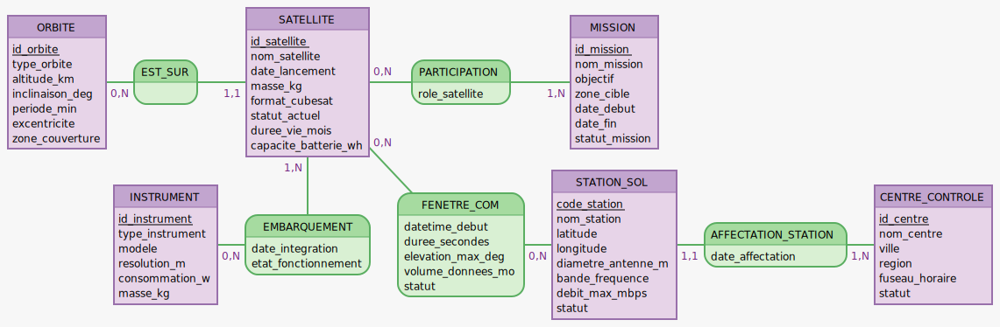

# L1-B — MCD MERISE NanoOrbit

**Module** : ALTN83 — Bases de Données Réparties  
**Projet** : NanoOrbit — CubeSat Earth Observation System  
**Groupe** : 06 — Oscar DEBEURET / Geoffrey IBOS / Hugo LEROUX  
**Phase** : Phase 1 — Conception & Architecture distribuée  
**Livrable** : L1-B — Modèle Conceptuel de Données (MCD)

---

## Diagramme

## Justification des cardinalités

| Association         | Entité A    | Card. A | Card. B | Entité B        | Justification                                                                                                                                                                   |
| ------------------- | ----------- | ------- | ------- | --------------- | ------------------------------------------------------------------------------------------------------------------------------------------------------------------------------- |
| EST_SUR             | ORBITE      | `0,N`   | `1,1`   | SATELLITE       | Une orbite peut exister sans satellite affecté (réserve orbitale) ; un satellite est sur exactement une orbite à un instant donné                                               |
| EMBARQUEMENT        | SATELLITE   | `1,N`   | `0,N`   | INSTRUMENT      | Un satellite embarque au moins un instrument ; un instrument peut être en catalogue ou en test sans être embarqué                                                               |
| CONCERNE            | SATELLITE   | `0,N`   | `1,N`   | FENETRE_COM     | Un satellite peut n'avoir aucune fenêtre planifiée (inactif, hors couverture) ; une fenêtre concerne obligatoirement au moins un satellite — elle est définie par rapport à lui |
| RECOIT              | FENETRE_COM | `1,N`   | `0,N`   | STATION_SOL     | Une fenêtre est nécessairement reçue par au moins une station sol ; une station peut n'avoir aucun passage planifié (hors service)                                              |
| PARTICIPATION       | SATELLITE   | `0,N`   | `1,N`   | MISSION         | Un satellite peut exister sans mission (en attente, en panne) ; une mission mobilise obligatoirement au moins un satellite                                                      |
| AFFECTATION_STATION | STATION_SOL | `1,1`   | `1,N`   | CENTRE_CONTROLE | Chaque station est rattachée à exactement un centre de contrôle ; un centre supervise au moins une station                                                                      |

---

## Choix de modélisation

### FENETRE_COM : entité à part entière

Dans le MCD initial, FENETRE_COM était une **entité-association** entre SATELLITE et STATION_SOL. Elle a été transformée en **entité autonome** car elle porte 5 attributs propres (`datetime_debut`, `duree_secondes`, `elevation_max_deg`, `volume_donnees_mo`, `statut`) qui caractérisent un événement de communication indépendant, identifiable et archivable. Deux associations distinctes la relient à ses entités partenaires : CONCERNE (vers SATELLITE) et RECOIT (vers STATION_SOL).

### Absence de lien direct SATELLITE ↔ STATION_SOL

Aucune association directe n'existe entre SATELLITE et STATION_SOL. Le lien est médiatisé par FENETRE_COM : `SATELLITE → CONCERNE → FENETRE_COM → RECOIT → STATION_SOL`. Cette architecture reflète la logique opérationnelle : c'est la fenêtre de communication, événement daté et qualifié, qui matérialise la relation entre les deux entités.

### AFFECTATION_STATION : association porteuse d'attribut

Bien que la contrainte soit simple (1 station = 1 centre), l'association porte l'attribut `date_affectation`. Elle est donc modélisée comme une **association avec attribut** plutôt que comme une simple clé étrangère dans STATION_SOL, ce qui permet de tracer l'historique des rattachements administratifs.

### EMBARQUEMENT : association porteuse d'attributs

L'association EMBARQUEMENT porte trois attributs (`date_integration`, `etat_fonctionnement`, `commentaire`) qui caractérisent la relation entre un satellite et un instrument à un instant donné. Ces attributs n'appartiennent ni au satellite ni à l'instrument seuls, ce qui justifie leur portage par l'association plutôt que par l'une des deux entités.
